# Create a serverless contact form (a case study in not re-inventing the wheel) - Part 1

## Author: complex robot
## March 11th, 2023

## Introduction

I'd love to say this is a great guide around setting up a serverless contact form. In theory, the architecture is incredibly simple. A POST to an AWS API Gateway invokes a Lambda function that passes a JSON data blob to SES to send an email. Very easy, very straight forward. This was a learning lesson more than anything, and I'd like to share my journey with you.

The intent is to be able to serve up a contact form that can accept input on a static website. This is an add-on of sorts to functionality described in previous articles (S3 web hosting and Cloudfront, to a degree). A contact form is a great way to have people reach out for products, services, or information, outside of a channel like regular email, or Facebook Messenger, or any other social/messaging channel. The advantage to a form over these other methods is that you can tailor specific responses in a form in order to shape the type of input you get from customers or prospects.

## How-(Not)-To

At the highest level possible our intended architecture will look like this:

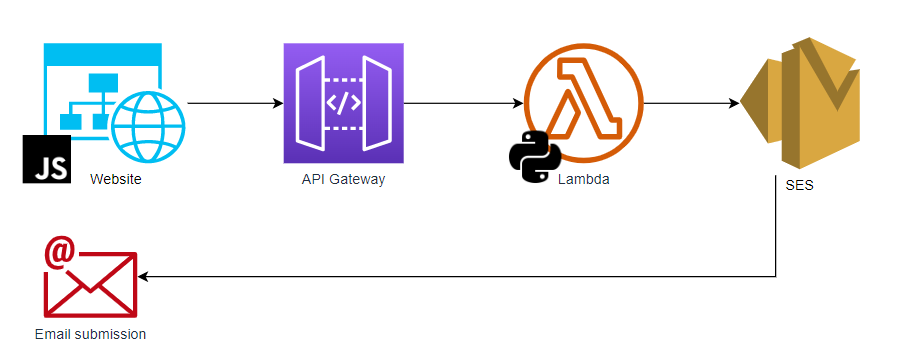

The website runs JavaScript to process the HTML based form, POSTs the request to the API Gateway which triggers a Lambda function written in Python to send all the relevant data to the Simple Email Service (SES) to provide the form data to our registered email address.

Easy peasy. Right? Let's get cracking.

* Log in to the AWS console for the account you will be setting this up on. Browse over to the SES service.
* This doesn't necessarily need to be the first step, but let's tackle it first. SES is the Simple Email Service. It is used for email messaging that can be used in a variety of ways, it's not to be confused with a managed email box service like Yahoo! Mail or Google Mail, but more for email based notifications. Every email that will be **receiving** emails needs to be registered and confirmed within the console.

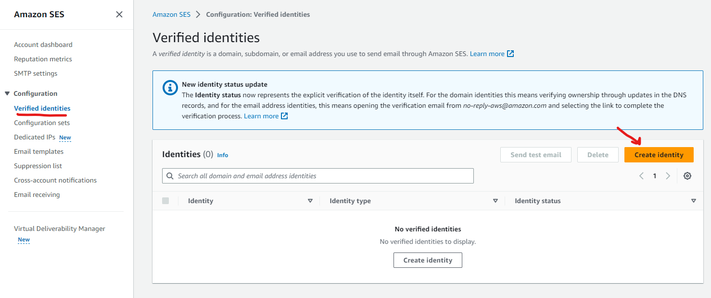

* Select the option to set up an 'Email address' identity. If you were using an entire domain for sending these emails you could use the Domain option. You need to verify ownership via record creation, but for the purposes of our architecture here a single email address is just fine. Enter the email address you'd like to receive form submissions to and click 'Create identity.'

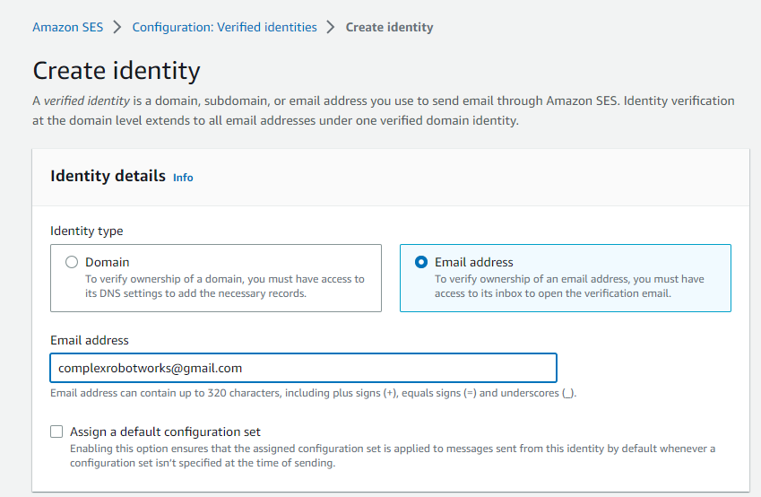

* Access the email box for the identity you are setting up and follow the link to verify the address. If all goes well you'll see the following:

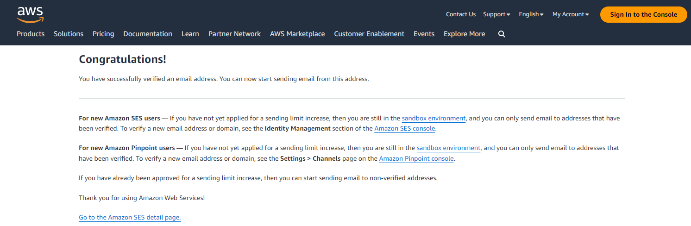

* You can cross confirm this by going back to the SES console and selecting 'Verified identities' - it'll now show your email of choice as verified. For now, we are done here.
* The next thing to do is prepare the IAM role for the Lambda function. This could be done later but if we address it now we won't need to deal with a basic execution role. Open the IAM console and select Roles then 'Create role'. As below select 'AWS Service', use case is Lambda, click next.

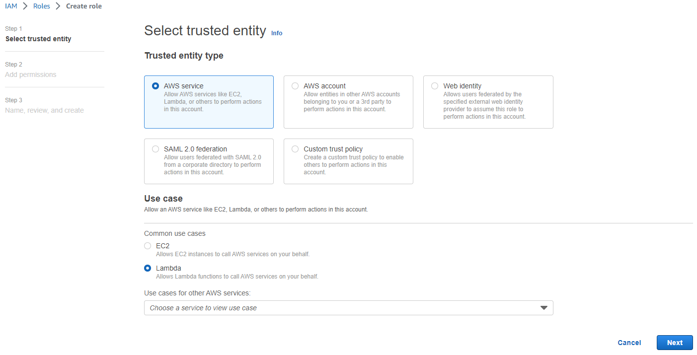

* On the 'Add permissions' page select 'Create policy' - this will open the policy creator in a new window. Select the JSON tab and enter the following policy:

```
{
    "Version": "2012-10-17",
    "Statement": [
        {
            "Sid": "VisualEditor0",
            "Effect": "Allow",
            "Action": "ses:SendEmail",
            "Resource": "*"
        }
    ]
}
```

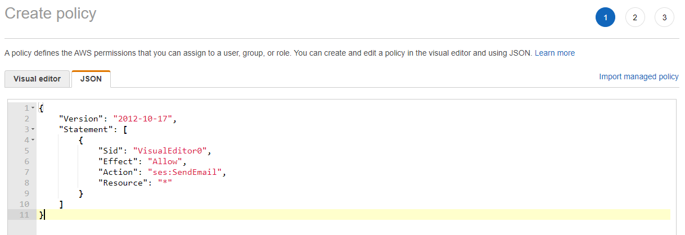

* Click 'Next: Tags', add tags if you'd like, click 'Next: Review', give it a name and description if desired and click 'Create policy'.

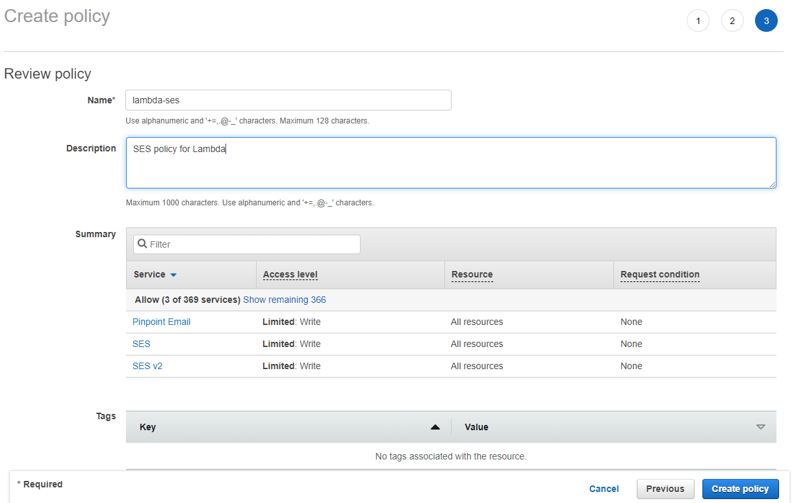

* Go back to the role you started creating and apply this permission policy to the role. Give the role a meaningful name, scroll down and click 'Create role'.

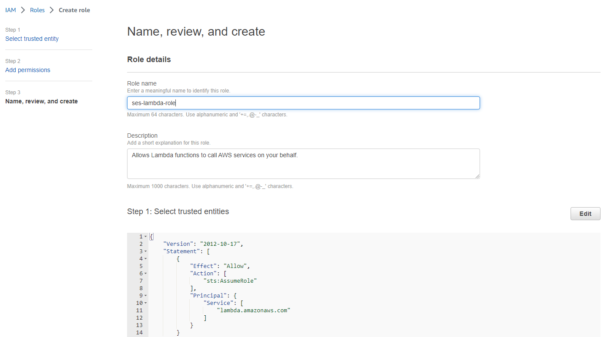

* The next port of call is the Lambda function. Select to create a new function, select 'Author from scratch', give the function a name, select 'Python 3.x' as the runtime (at the time of this writing it's 3.9 but any version 3 variant should be fine), seelct *x86_64* as the architecture. Click into the 'Change default execution role' tab and select the role we just created before. See below:

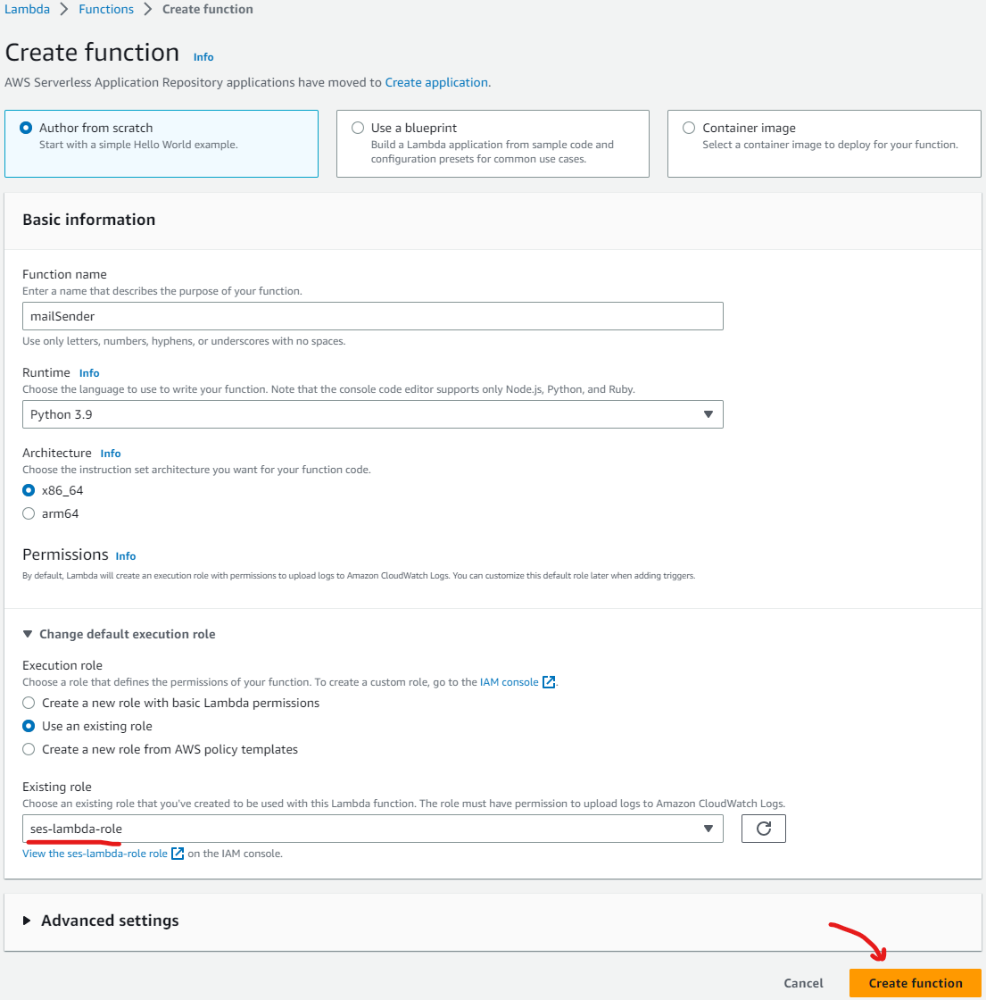

* Copy and paste the following code in the 'Code source' window:

```
import json
import boto3
def lambda_handler(event, context):
    ses = boto3.client('ses')
    print(event['name'])
    body = 'Name : ' + event['name'] + '\n Email : ' + event['email'] + '\n Phone : '+ event['phone'] + '\n Query : ' +event['desc']
    ses.send_email(
        Source = '*******@gmail.com',
        Destination = {'ToAddresses': ['******@gmail.com']},
        Message = {'Subject':{
               'Data':'Testing SES python',
               'Charset':'UTF-8'
           },
           'Body':{
               'Text':{
                   'Data':body,
                   'Charset':'UTF-8'
               }
           }}
    )
    return{'statusCode': 200,'body': json.dumps('wohoo!, Email sent successfully ')}
```

* Replace the 'Source' and 'Destination' email addresses with the email address you verified in SES earlier. **DO NOT SKIP THIS STEP!**
* Click File > Save and then the Deploy button.

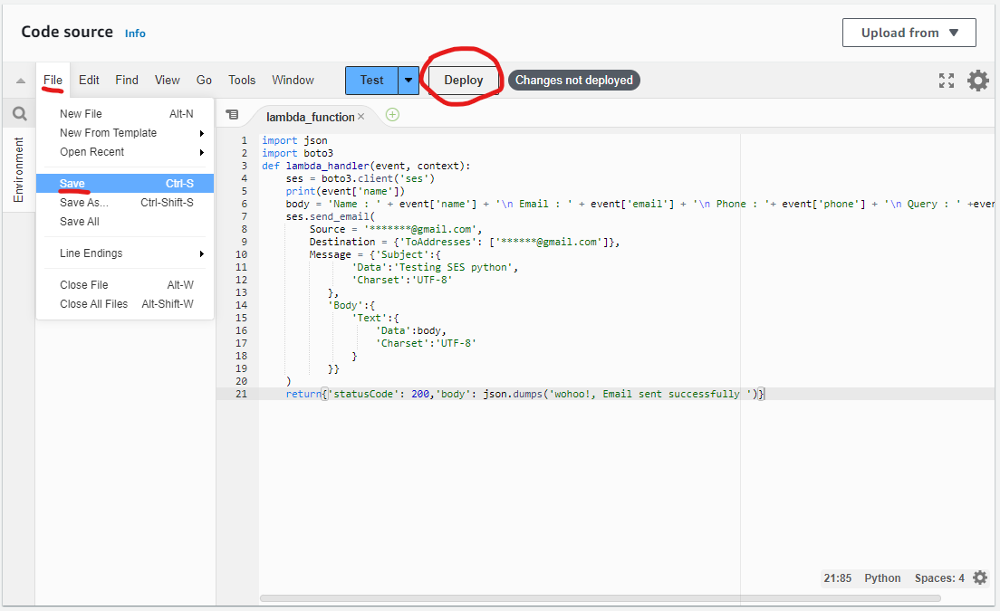

## What does this do?!

Let's break it down quickly.

At the very top we have our *import* statements to bring in a library for parsing JSON data as well as boto3 which is Amazon's Python SDK. *lambda_handler* is a function that initiates the SES connection as variable 'ses'. The print statement (I assume this is logged but never really checked) will print the entered name from the form from the event. Right after this the 'body' variable becomes a string that takes all the data entered into the form. *ses.send_email* is the function invoked to take all the data provided and wrap it inside a valid JSON structure. The call is made to the SES service and if a 200 response is received (success) it's reported back.

* The next thing to do is to set up the API Gateway. Without an API Gateway the form has nowhere to post to. We would typically see this type of request handled by a gateway of some kind (think PHP, CGI-BIN type stuff), but in our use case we will be creating an Amazon API gateway.
* Navigate to the 'API Gateway' service on AWS and select 'Create API'. Select *Build* under the REST API section.

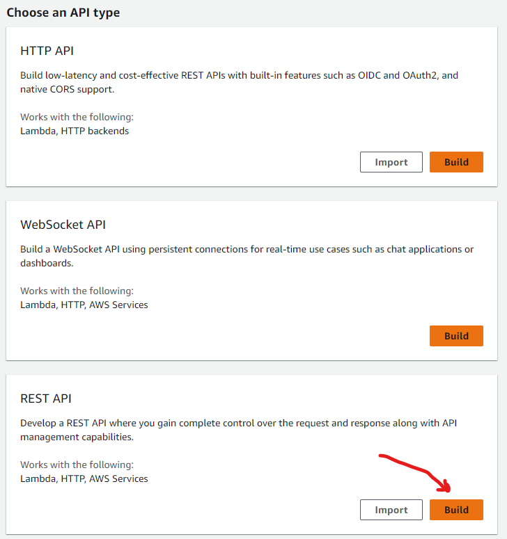

* Select REST as the protocol, select 'New API', give it a friendly name and a description if you wish and select 'Create API'

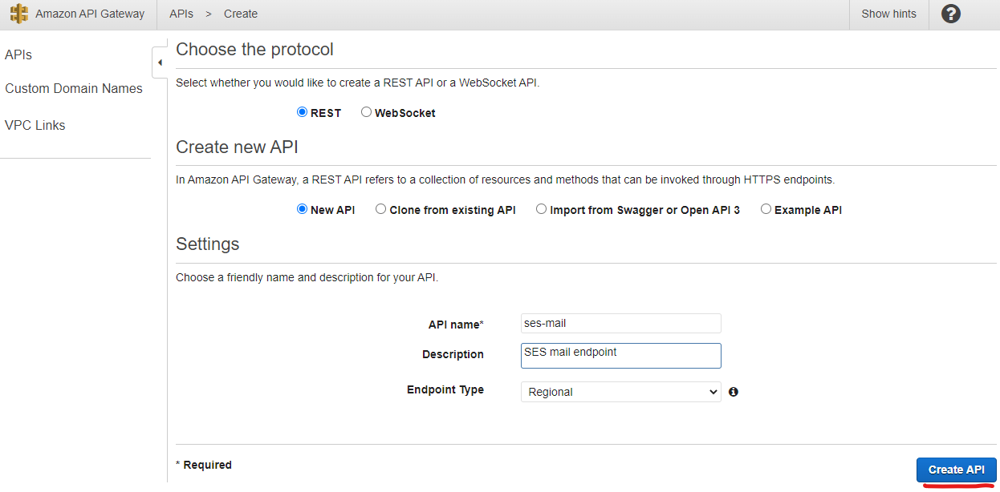

* On the next screen that comes up select 'Actions' and 'Create Resource'. Set a Resource Name, the Resource Path (this will be the URL endpoint) and be sure to enable API Gateways CORS, all as shown below.

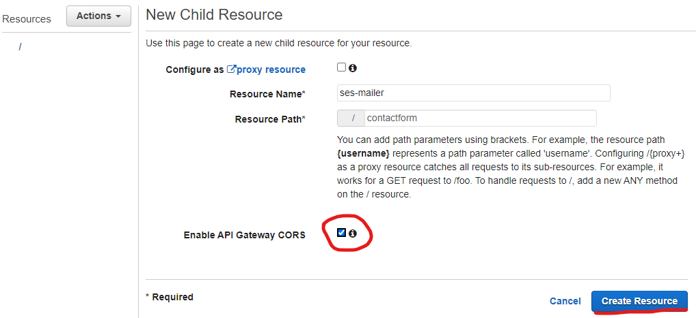

* After creation you'll see an OPTIONS resource. We're going to create a POST method now by clicking on the resource we just made, selecting 'Actions' again and then 'Create Method'. Select POST and click the check mark.

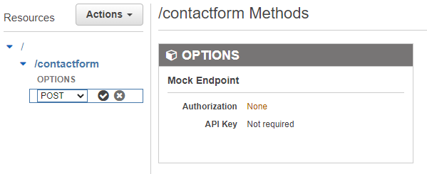

* Select the integration type as 'Lambda Function', choose the appropriate region for your function and provide the name of the function as you created earlier, our example shown below. Click Save.

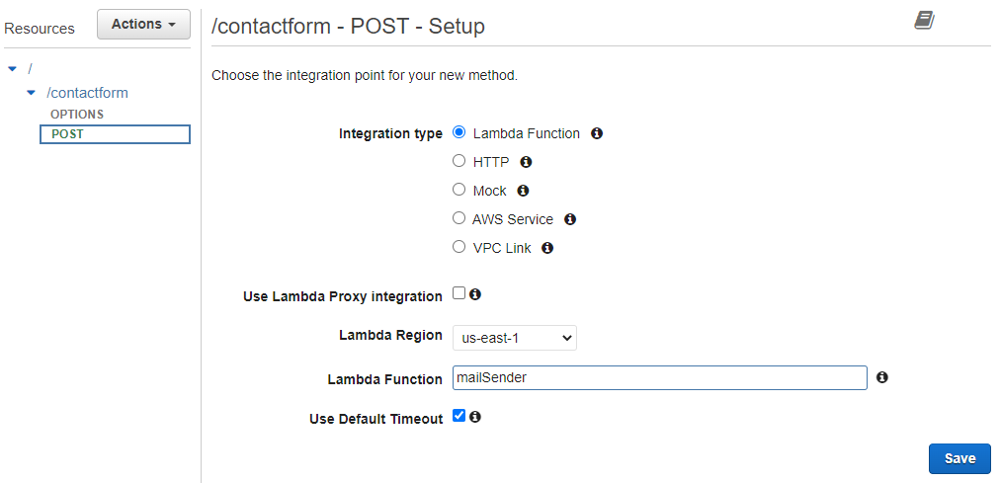

* There will be a very fast popup that is presented making you aware that the API Gateway will be allowed to invoke the Lambda function. Simply click OK.

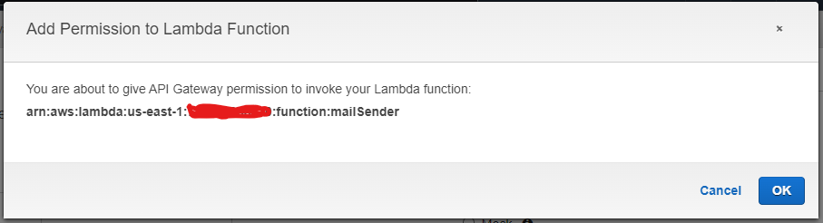

* We should at this point be brought back to the 'POST - Method Execution' screen. We need to deploy the API so at this point simply click on Actions again and 'Deploy API'. Enter a stage name, it doesn't much matter what you call it, enter a stage and deployment description if you'd like and click Deploy.

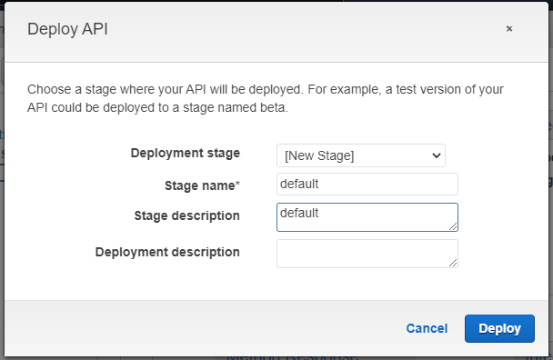

* If we click into Stages on the left hand menu and then into the POST method we set up we will be able to grab the invocation URL as shown below:

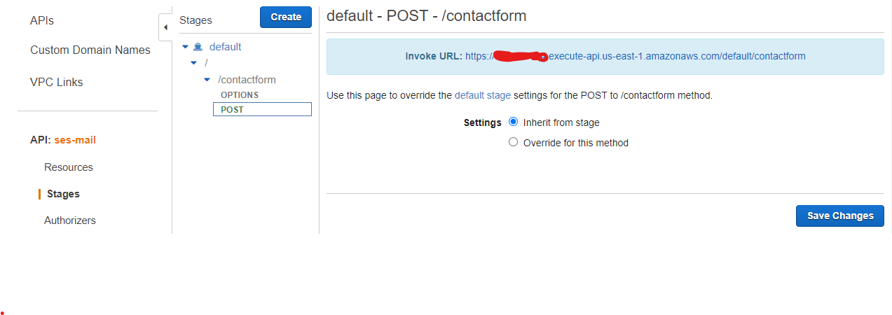

* Settings will by default be inherited by the stage name (in our example here, 'default'). You may want to either modify rate limiting there, or, you can override the POST method and specify whatever rate limiting settings you'd like. More on this later, it becomes a crucial point... keep it in your back pocket for now.
* If you click back into the Lambda function for the SES mailer you will now see the API Gateway is the trigger for the Lambda function.

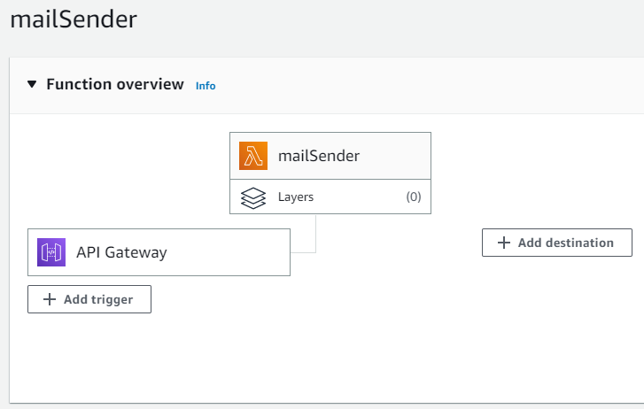

* At this point, our SES email address has been verified, our Lambda function is set up to interact with SES and our API Gateway is in place to accept the POST request from the form on our page. AH, yes, let's quickly get together a form to test this out. This is going to be incredibly ugly, but we don't care because we just want to test out the functionality. Copy and paste this into an HTML document - **be sure to replace the API endpoint URL with yours!!!**:

```
<!DOCTYPE html>
<!--[if lt IE 7]>      <html class="no-js lt-ie9 lt-ie8 lt-ie7"> <![endif]-->
<!--[if IE 7]>         <html class="no-js lt-ie9 lt-ie8"> <![endif]-->
<!--[if IE 8]>         <html class="no-js lt-ie9"> <![endif]-->
<!--[if gt IE 8]>      <html class="no-js"> <!--<![endif]-->
<html>
    <head>
        <meta charset="utf-8">
        <meta http-equiv="X-UA-Compatible" content="IE=edge">
        <title></title>
        <meta name="description" content="">
        <meta name="viewport" content="width=device-width, initial-scale=1">
        <script src="https://ajax.googleapis.com/ajax/libs/jquery/3.6.3/jquery.min.js"></script>
        <script>
            function invokeAWSAPI(e) {
                e.preventDefault();           
                var name = $("#form-name").val();
                var phone = $("#form-phone").val();
                var email = $("#form-email").val();
                var msg = $("#form-message").val();
                var data = {
                    name : name,
                    phone : phone,
                    email : email,
                    msg : msg
                    };
            $.ajax({
                    type: "POST",
                    url : "https://<api ID here>.execute-api.us-east-1.amazonaws.com/default/contactus",
                    dataType: "json",
                    crossDomain: "true",
                    contentType: "application/json; charset=utf-8",
                    data: JSON.stringify(data),
                    success: function () {
                    alert("Successful");
                    document.getElementById("contact-form").reset();
                location.reload();
                    },
                    error: function () {
                    alert("unsuccessful");
                    }});
                }
        </script>

    </head>
    <body>

        <form id="contact-form" class="post-reply" method="post">
            <span>Name *</span>
            <input id="form-name" class="input" type="text" name="name" placeholder="Enter name here…">
           
            <span>Email *</span>
            <input id="form-email" class="input" type="email" name="email" placeholder="Enter name here…">
           
            <span>Phone</span>
            <input id="form-phone" class="input" type="phone" name="phone" placeholder="(Optional) Enter phone number here…">
           
            <textarea id="form-message" class="input" name="message" placeholder="Your Message Here"></textarea>
           
           <button class="primary-button" onClick="invokeAWSAPI(event)">Submit</button>
        </form>
    </body>
</html>
```

* Let's VERY QUICKLY run through this, since I feel like understanding what's happening in code is essential.
    *  The form itself is an unstyled mess. I had actually originally intended to make a nice form using Bootstrap components, but since this isn't the solution we're ultimately using I didn't want to spend too much time making it pretty (I did end up re-using what I was going to, but for the purposes of this test it doesn't matter what this looks like). 
    * The form contains four fields - name, email, phone and message. This is totally customizable - anything you add obviously needs to be added to the Lambda function in turn so that the information is plucked out of the web request. We're going to keep it to this though.
    * When the form is filled in an POSTed it will call the 'invokeAWSAPI(event)' function. The form event (data) is stored in the *event* variable.
    * Looking toward the top of the HTML file we see the definition of the invokeAWSAPI function. This script sets variables for each element of the form using jquery (calling the id of each element). This is stored inside of a data object which is ultimately built into a request header for delivery to the API endpoint.
* If we test this out now we should be able to fill in the form, hit Submit and receive an email, let's see:

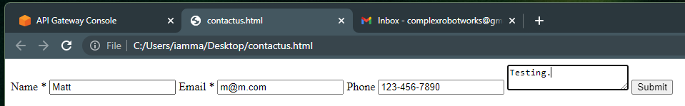

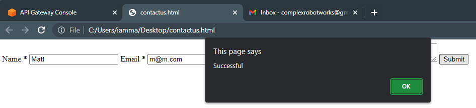

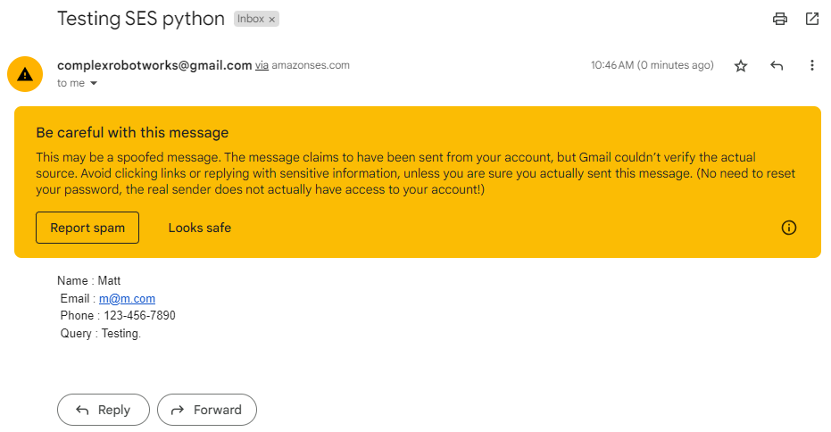

It works! Fantastic! Let's just style up the form, hook everything up nicely and we're off to the races. Case closed right?

...

### Well, not quite.

This is where my security mind took over and I started asking questions.

My first realization is that by default our SES setup is in what's called sandbox mode. This is fine, I think, for our limited purposes, but for a larger company or one really leveraging a contact form our limit of 200 per 24 hours might be kind of restrictive.

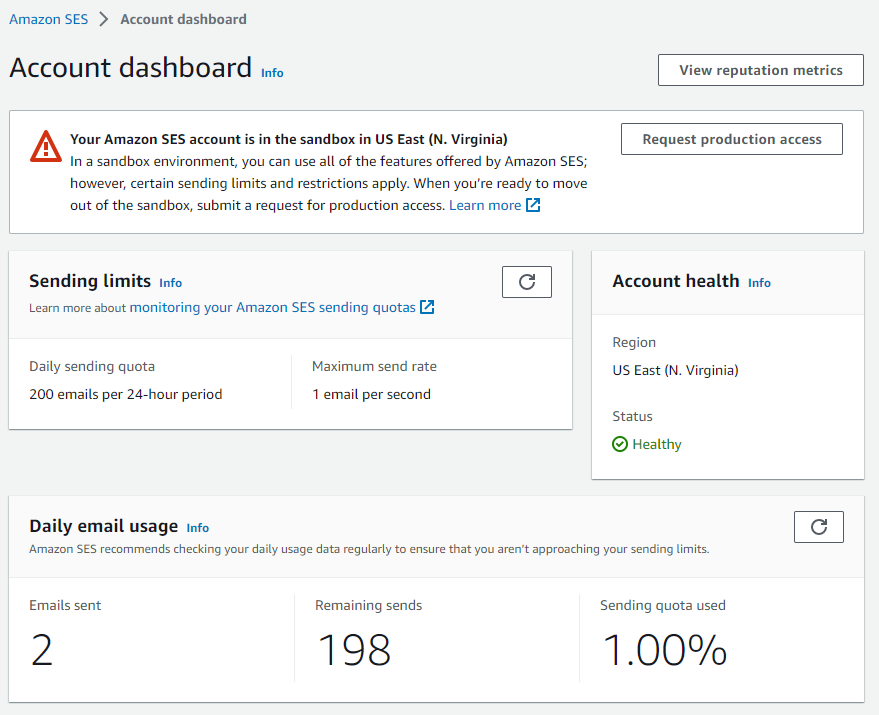

No problem, easy enough to get this out of sandbox mode and into production mode (just have to request it from AWS).

Thinking about the API rate limit which we didn't explicitly set, we know in a 24 hour period we only get 200 emails. By default our API rate threshold is WAY higher:

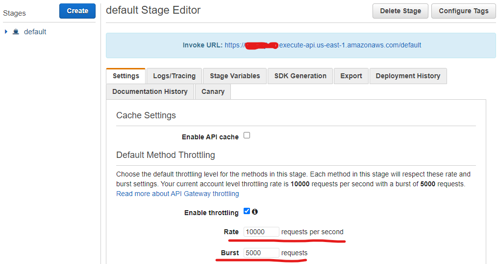

So let's even suppose we set it to 1 request per second and burst to 1 as well. There's nothing really restricting someone to using the form over and over and over and racking up a boatload of emails, plus costs on our end. And for me, these are my two most important things - how secure is this, how much does it cost?

What's the likelihood of this happening? Maybe low. I don't know. But I'd rather not take my chances...

My next thought was someone using an automated method for attacking something like this using a tool like Burp. Burp is an amazing tool for analyzing and manipulating web requests, generally viewing traffic, amongst many many other plugins that can be installed for review of web applications.

One of the tools that comes stock with Burp is the Repeater. This allows you to capture a web request and send it over and over and over.

Let's open up Burp, open up the built in browser and turn on Interception. Open up the contact form we built earlier within the Burp browser and fill out the form, press Submit.

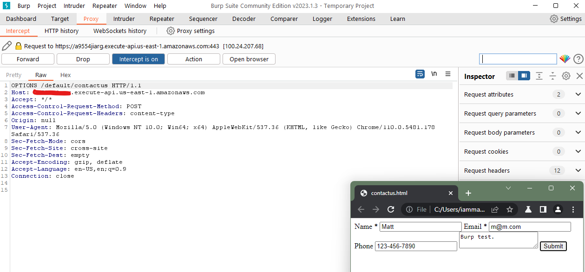

Our request is currently being held. Let's hit Forward.

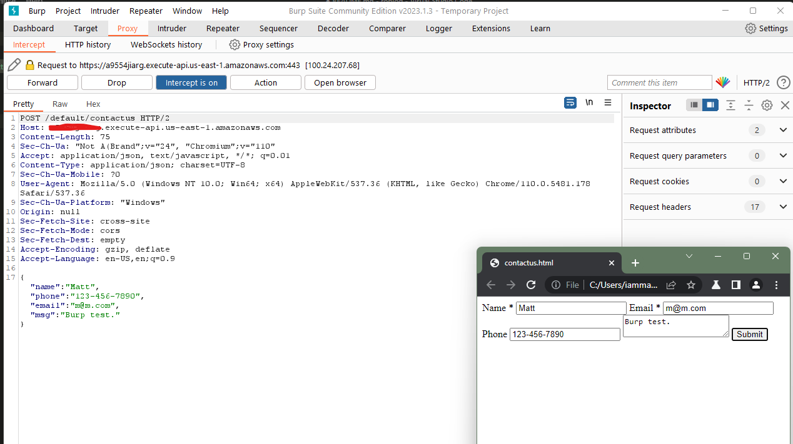

Here now we see our JSON body payload. Click Forward.

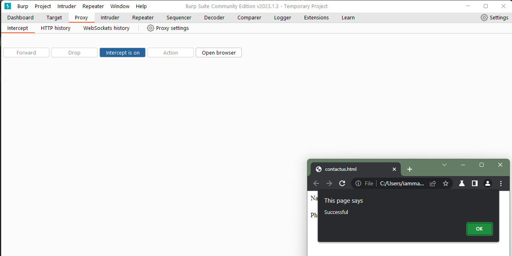

Ok, sweet. No change in functionality. I check my email, it came through.

Let's do the same thing, but this time I am going to send my request with the body payload to the Repeater.

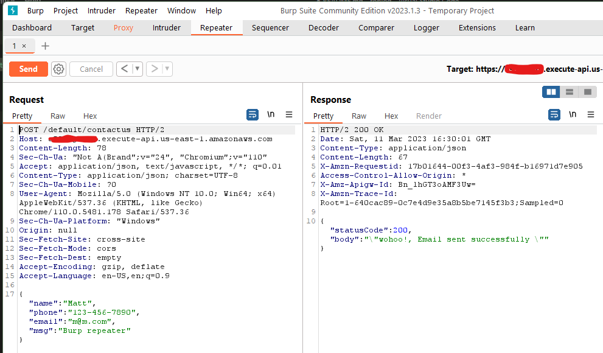

I sent the request about ten times.

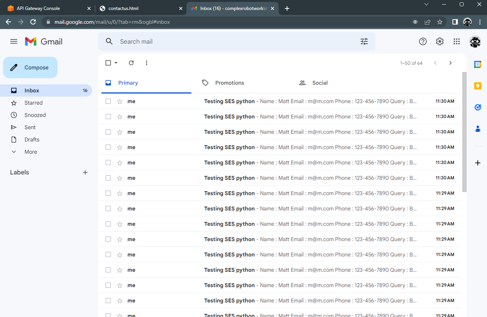

Uh oh.

So there's really nothing protecting us against this, except MAYBE the rate limit of 1 per second. Which doesn't really help because in 200 seconds our pool of available daily emails will be depleted. Not to mention, you do pay for each email sent via SES, so if we were in production we could VERY EASILY have tens of thousands, hundreds of thousands emails thrown into a mailbox within minutes. I'm manually clicking the Send button on the Burp Repeater but this can be automated **very** easily and **very** aggressively.

Well, what the hell can we do?

Knowing a little about forms and what I've seen out on the Internet in other places, maybe we can add a Captcha. Great! Problem solved! A person (hopefully) will need to solve a puzzle in order to use the form. 

I ended up looking into Google reCAPTCHA for this, it's free for a certain amount of requests, so for a small business or one using a very limited amount of contact form requests this would work. At this point though, I'm feeling like this solution is becoming a little over engineered... I took a step back and looked at how this is shaping up. Let's recap our original architecture:


But we know that we also need to introduce a GCP project for reCAPTCHA (at least through this service), which means we're now running infrastructure and code inside of AWS as well as having a reliance on GCP (with separate credentials, billing, etc) for reCAPTCHA. This might be kind of a hard sell to a customer - "Oh hi, yes I can do a contact form for you, but in order for it not to cost you a billion dollars you also need to sign up for a GCP account, put your credit card in there too and give me full access so I can set up a GCP project and application for reCAPTCHA". 

Sounds like it's going to go very well.

As a quick aside, I also looked into the CORS settings on the API gateway. You may remember that we enabled CORS, and by default, the origin is set to '*' - this means ANYONE, ANYWHERE can hit this public API endpoint. Why don't we just restrict this to our site?!

So on AWS API Gateway, we can. And I won't bore you with screenshots and details around that, but basically there is a limitation with the CORS specification that will only allow one origin. Unfortunately, the way my S3 hosted site is architected allows redirect to https://complexrobot.net from https://www.complexrobot.net, but *the origin is not re-written*. So even though I ended up at https://complexrobot.net, and I could set the CORS Allowed-Origin setting to 'https://complexrobot.net'. This actually DOES work very well, but, for someone who came from https://www.complexrobot.net the form will not function. C'est la vie. If you're ok with that limitation then rock and roll with it, but for me, it was a bit of a downer. It also doesn't appear you can re-write the origin (which from a security perspective actually makes perfect sense).

This whole thing is becoming too complex and unwieldy. No pun intended.

In another write up, a follow up to this, I'll investigate a platform that can provide the functionality we're looking at. This is a classic case of "Can we do this? Yes. Should we? Probably not."

## Recap

If you made it this far, you're a champ. Or a glutton for punishment. Or you just wanted to see how sad and deep this rabbit hole got 🤣

From the top though, extremely high level, this is what we accomplished:

1. Set up a verified email address in SES.
2. Configured the role needed by the Lambda function to use SES for sending email.
3. Set up the API Gateway, configured the needed resource and method, configured the Lambda function integration.
4. Created a very quick example HTML form document and tested successfully. 
5. Proceeded to think about the security implications and became very sad.

## Important notes and limitations

I feel like this is pretty well covered above. So yeah, if anyone would like to make a PR and correct me on any of these points, that'd be swell. I've spent WAY more hours on this than I should have, but I guess at the end of the day it was a good learning experience. 

Thanks for reading!

March 11th, 2023
