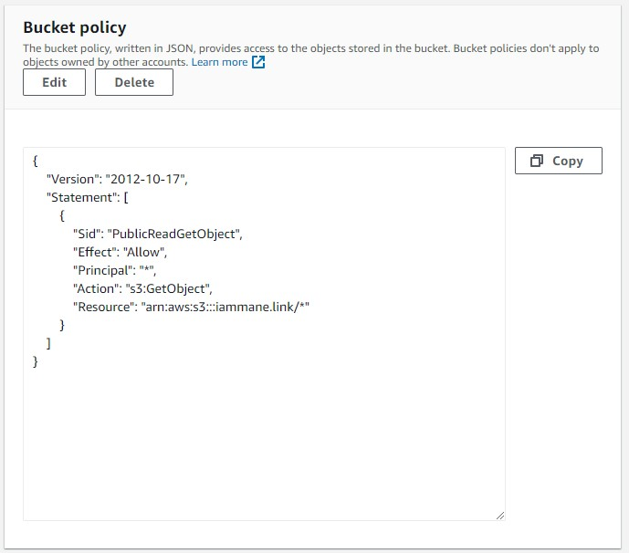

# Front your S3 website with CloudFront

## Author: complex robot
## February 13th, 2023

## Introduction

This guide is a fantastic follow up to the previous "Serve a static site in an S3 bucket", it addresses some of the shortcomings and issues around hosting a static website out of S3 natively.

The required steps are a little more in-depth than the previous guide, and this guide assumes you already have a static site being served up via S3 on AWS. The assumption stands that you also have your DNS hosted zone configured on Route53. 

You will need a couple of things to configure the architecture for this article:

1. Be sure you have a website configured in an S3 bucket. Without a site configured in this configuration there's not much point going through these steps (though in all fairness, you can front access to an S3 bucket for object access in the same exact way, but this is written from the perspective of a website and not just object storage).
2. Be prepared to be patient for CloudFront to update from origins. I'll explain more about this later. This setup isn't quite as quick as the S3 website setup.

For the purposes of this guide I will be using *iammane.link* as our example domain and site, you of course will substitute your own.

## How-To
* Log in to the AWS console for the account you will be setting this up on, ideally one that's already hosting a website out of an S3 bucket.
* In the services window type in CloudFront and click to access the CloudFront configuration window. If you've never created a distribution before there will be a button that reads "Create a CloudFront distribution", if you already have at least one you'll be brought to the Distributions screen where you can add a new one. Regardless, click what's needed to create a new distribution.


* You will be prompted to choose your origin domain. If you followed the previous guide you will see two choices exist already (though you may have more if you have created multiple S3 buckets with the website endpoint enabled). At this point we only want the S3 bucket for the **root domain** (ie, in my case *iammane.link*, for you, *yourdomain.com* or similar).

### WHY IS THIS??

We are going to use a method for specifying what's called an alternate DNS name on our distribution. This will end up covering our root domain and "www" use cases where we needed the redirect bucket before. We ultimately will no longer need the redirect bucket (so not only is this a better solution but it's also cleaner!)

* Choose the root level bucket - a warning will pop up immediately saying that the AWS recommendation is to use the website endpoint. **DO NOT USE THE WEBSITE ENDPOINT!** - While this is the recommended way to configure the CloudFront distribution you will not be able to restrict origin access to only CloudFront later on. This resolves a security/operational concern.

🚨If I am wrong here, PLEASE submit a PR with the correct way of being able to do this with the website endpoint. I spent several hours trying to fix this how I wanted it and it just doesn't seem possible, but if it's possible to do it in the way AWS suggests I'd love to know (and I will happily credit you!) 🚨


* Continuing down the line (I will need to break these screen shots up a little, there's quite a bit to configure here) you will want to select 
"Origin access control settings (recommended)" under the "Origin access" heading. Select the S3 bucket as shown


* AWS tells us we will need to update the bucket policy later, this is fine - just keep it in mind for now.
* Skip the part about custom headers, it's out of scope for this guide. We also do not want to enable Origin Shield (it wouldn't be such a bad idea in some cases, but for our use case it's overkill and will become expensive).
* Under the "Viewer" section we will want to select "Redirect HTTP to HTTPS". Continue scrolling down until you hit the Settings section.
* My recommendation under settings is to select "Use only North America and Europe" or "Use North America, Europe, Asia, Middle East, and Africa" depending on where your users are primarily located. The more locations being used, the higher the cost may be. There is a little caveat to this though, at least at the time of writing - any items cached to CloudFront FROM S3 incur no charge. In my experience I've not yet been charged for using CloudFront, but I would tailor your choice to what makes sense for what you are hosting. See below.


* "Alternate domain name (CNAME) - *optional*" - though this is listed as optional, for our purposes it's very much not optional. This is what will allow us to capture redirects for subdomains *without* needing a redirect S3 bucket. In my case I am entering "iammane.link" and "www.iammane.link" as the alternate CNAMEs.


* Another incredibly important step next that is also listed as optional is the "Custom SSL certificate - *optional*" step. This is ultimately what will give us our "padlock" on the site. Long story short, the way this works is that the client will connect to our CloudFront distribution using a certificate which is trusted up to the distribution. Since our site is loading off the CloudFront Edge it never needs to go any further and is encrypted end to end, hence, our lovely little padlock. If you have already requested a certificate for the site you may select it, if not, click on the link for "Request certificate" which will open in a new tab. We will continue from this point since it's quite likely you don't have one, and for iammane.link I currently do not either.
* In the new tab that opened click on "Request a public certificate" and click Next. 🚨 Be **certain you are making the certificate in the us-east-1 region!!** It does matter for CloudFront distributions, a CloudFront distribution can only have a certificate applied to it if it's been created in the us-east-1 region! 🚨
* You will need to enter **ALL THE CNAME DOMAINS YOU SPECIFIED IN THE PREVIOUS STEP!** The certificate we get assigned must match whatever URLs we are using to access our CloudFront distribution. For the selection of DNS validation or email I would recommend using DNS validation, it's substantially faster and we already manage the DNS for our domain. All other options are fine, hit Request at the bottom once you've configured your certificate request as such using your domain name and CNAMEs


* The next screen that comes up in this tab will note the request has been successful and you'll need to click "View certificate" at the top to get the information needed for DNS validation. Go ahead and click "View certification" as shown


* At this point still in the same tab you'll be brought to a screen that shows the certificate is still pending validation. For each CNAME you configure on the certificate you will need to create a CNAME record in Route53. There is a link to create the CNAME records in Route53 as shown below ("Create records in Route 53"), click the button and it will prompt you that AWS will create the records on your behalf. Simply hit "Create records"


* Once this is done, it will take a little bit of time. On the AWS Certificate Manager configuration panel you can refresh the certificate status. For me it took about two minutes, but the "Pending validation" status did eventually change to "Issued" as shown below. The certificate is now ready to be used.


* Close the certificate manager tab and go back to the CloudFront distribution setup tab we were originally working out of. 


* Do NOT select the "Legacy clients support" radio button. For our use case this simply isn't needed, and even for most production workloads this is not required (it's only required for VERY legacy browsers that cannot support SNI).
* Leave the "Security policy" section at defaults. 
* For the "Default root object - *optional*" setting I do like to play it safe and specify my root .html file, which in this case is index.html. If you are using something other than index.html that's fine, but it should match whatever your root/home page file is in your S3 bucket.
* You can leave description blank, but if you intend on having more than one distribution it can be handy to specify what it's used for. I am naming this one "iammane.link CF dist"
* FINALLY, click on "Create distribution".


* As shown above, you will notice a couple of things immediately. The distribution has been created successfully but is in a deploying state. This does take a little bit of time. If you tried to access the distribution right now using the distribution domain name it will work, even though we've configured it not to using our "Origin access control settings". However, from the previous guide, our iammane.link bucket (and quite possibly whatever one you are using) is still fully public. Thankfully, there is a handy reminder at the top of this page that says we need to update our bucket policy. Click on "Copy policy" and then click on the link that reads "Go to S3 bucket permissions to update policy" - it will open in a new tab.
* Our existing bucket policy on the iammane.link S3 bucket looks like the below:


* You'll remember this was to allow anonymous read access to the bucket so folks on the Internet can view our website. What we need to do now is restrict access to the website to *only* CloudFront. This will alleviate some of the previous concerns from the old architecture. Click on Edit and paste in the bucket policy you copied from the CloudFront Distributions screen. Once you paste it in click on "Save changes".
* Just to quickly show and explain, here is what the policy will look like (note however the placeholders will have your CloudFront and S3 bucket information):

```
{
        "Version": "2008-10-17",
        "Id": "PolicyForCloudFrontPrivateContent",
        "Statement": [
            {
                "Sid": "AllowCloudFrontServicePrincipal",
                "Effect": "Allow",
                "Principal": {
                    "Service": "cloudfront.amazonaws.com"
                },
                "Action": "s3:GetObject",
                "Resource": "arn:aws:s3:::<YOUR-DOMAIN.COM>/*",
                "Condition": {
                    "StringEquals": {
                      "AWS:SourceArn": "arn:aws:cloudfront::<YOUR ACCOUNT>:distribution/<YOUR DISTRIBUTION ARN ID>"
                    }
                }
            }
        ]
      }
```

So what does this do? It's pretty similar to our open access bucket policy from before, except instead of an unnamed principal (the "*" from before) we are specifying that the principal should only be "cloudfront.amazonaws.com". The action is "s3:GetObject" like before as well, however, it's ONLY allowed on the condition that the requesting ARN matches the CloudFront distribution we've set up for this site. If there is any other out of band request it will be denied. Remember - AWS policies work on a deny, allow, deny basis (explicit deny first, then allows, then anything not explicitly stated is denied).

* You can verify at this point the behavior is as we intend. If you open an incognito window or private browsing session (to ensure your AWS session isn't active) and try to browse to the S3 website endpoint URL you will see a screen like this:


* However, if you browse to the CloudFront distribution endpoint you will actually get the correct site displayed:


* Again, the keen eyed will notice we're still missing one very important thing... we don't want to give folks our xxxx.cloudfront.net URL! The whole point is that we want to direct our old DNS A records to the CloudFront distribution. If you attempted to access in our case iammane.link now you will be confronted with this:


* YIKES! Why?! Remember, our DNS A records are still pointing directly to the S3 website endpoint, which is *no longer allowed due to our bucket policy*. All we need to do is swing over to Route 53 and update our A records! Click into the Route 53 console on AWS.
* Inside of our hosted zone in Route 53 find the two A records for your site (if you followed the previous guide they'd be in the format of yourdomain.com and www.yourdomain.com) and delete them.


* Click to create a new record. As shown below, leave the subdomain blank, keep it as an A record, Alias like before but this time select "Alias to CloudFront distribution". Select the matching CloudFront distribution in the drop down and choose "Create records".


* Perform the same for the *www.yourdomain.com* A record (in my case, *www.iammane.link*) and you'll notice the same CloudFront distribution is available BECAUSE have configured the www CNAME on the certificate and distribution! This allows us to essentially cut out our www.yourdomain.com bucket entirely (the one we were using as a redirect for www.yourdomain.com requests).


* Click on "Create records".
* Once DNS has updated you can now browse to your site using either http://yourdomain.com or http://www.yourdomain.com. Both of them will redirect to HTTPS and should be hitting the CloudFront distribution you just created. You can verify this is the correct routing by using tracert/traceroute (depending on your OS) - see below for the example of iammane.link on the Windows OS:


* Take a breath, pull up your website using either yourdomain.com or www.yourdomain.com and bask in the glory of your wonderful, beautiful padlock.

## Recap

There is an awful lot we configured here, but let's quickly recap!

1. Created a brand new CloudFront distribution for our yourdomain.com site which is hosted in an S3 bucket. 
2. Used the S3 endpoint and configured it to use "Origin access control settings" to restrict the ability for anything other than CloudFront to access the origin (in this case, the S3 bucket).
3. Set which edge locations would be used and set our CNAMEs for the new distribution, essentially dictating what DNS names would be able to reference this CloudFront distribution.
4. Requested a public certificate through the Amazon Certificate Manager and configured it to use the same CNAMEs we specified on the CloudFront distribution.
5. Validated the certificate using Route 53 DNS validation and applied it to the CloudFront distribution we created. 
6. Deployed the CloudFront distribution and updated the S3 bucket settings to allow only the ARN of our distribution to access the origin.
7. Updated our DNS A records to point to the CloudFront distribution we configured rather than the S3 website endpoints (which are no longer functional due to the updated bucket policy).
8. Verified access to the site is blocked from anything except the CloudFront distribution and also verified using trace route that the destination is in fact a CloudFront endpoint.

## Important notes and limitations

As with the native S3 hosting from the other article you still can only host static content. This is a truly serverless architecture for static web hosting. For some, this is great because you can solely focus on the content of the site without needing to worry about updates, patches etc. On the flip side, the amount of functionality you can get out of this architecture is limited to client side activities only (same as before, we're beholden to client side JS, HTML, CSS etc).

Since at the time of this writing there is no cost for data transfer into CloudFront from S3 I can't think of a compelling reason to NOT use CloudFront as the main entry point to your S3 hosted website. There's more pros (valid SSL cert, cached, speedy site access, no cost) vs the con of spending a bit more time setting it up and configuring it. It's also a cleaner solution because you can delete your www redirect bucket (I didn't discuss it here, but will definitely be deleting it right after I'm done with this write up).

There is *one* disadvantage I have uncovered, but I don't believe this is unique to CloudFront, likely most/all CDN's, but if you change a file in your bucket unless you invalidate the item on the CloudFront distribution it could take up to 24 hours for the updated asset to actually show. This is due to the fact CloudFront will cache assets for ~24 hours. You can force a "refresh" so to speak by using the invalidation functionality, but depending on the amount of files you may incur charges for this. I find in practice though the benefits of the whole architecture far outweigh the small number of gotchas and for my own projects when using S3 web hosting I wouldn't consider not using CloudFront.

Thanks for reading!

February 13th, 2023