# Rolling your own WordPress instance - Live Blog

## Author: complex robot
## March 29th, 2023 through April 7th, 2023

## Introduction

Hello gentle readers! This roblog post is going to take a slightly different format to the others I've done so far. One of the things I've been wondering about is the viability / cost of self hosted WordPress on AWS. For folks who *do* want to control their own content this is an architecture that could enable them to (maybe) do it on a budget without needing a developer to come in and make changes to their content via code every time they need to update something.

AWS does provide a few different options for getting this kind of architecture off the ground, I'm going to be exploring an option that would be fit for a **small business**, portfolio, personal page etc where there will not be very many pages and there will not be a ton of content (it doesn't take a genius to know if you're a photographer and you're hosting all your photos on an EBS volume attached to your WordPress instance it's going to get very costly very quickly.)

Each day I work on this I will post what I did, how I achieved it, include screen grabs where needed and we will go on a journey of learning to see if this is a sensible option, or not! I figure if we can launch a small site for under 10 bucks a month then that's a pretty good savings over what you'd be spending for a non self-hosted option. Without further ado, let's kick this off and lay some framework in place.

## March 29th, 2023

Let's state the problem first. We want to self-host a WordPress site so that we can hopefully:

* Cut costs
* Manage our own content without needing a web developer

If we're able to achieve these two goals then this will be a success.

Before doing any kind of deployment we need to gauge the cost side of the house. This is simple with AWS using the Billing console! Log into your AWS account with an appropriately permissioned account and search for Billing. When you're there click into 'Budgets' and if you don't already have a budget set up let's do it now. 

The average cost (from what I've seen and from folks I've spoken to) shakes out to usually $9.99 a month to upwards of $25 a month to run a managed WordPress instance. Select 'Create budget' and select the options below (this is just a quick way of getting started, if you're familiar with AWS Budgets then by all means set whatever you'd like, or use whatever you have existing):

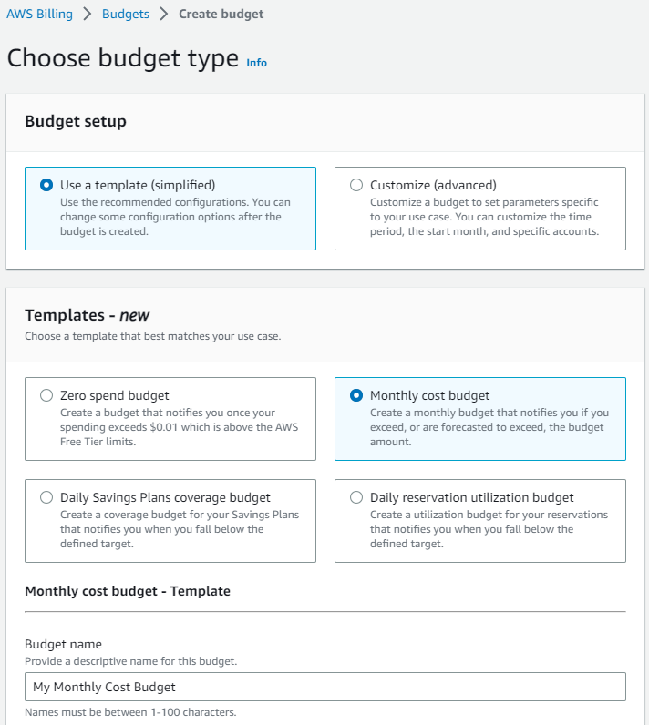

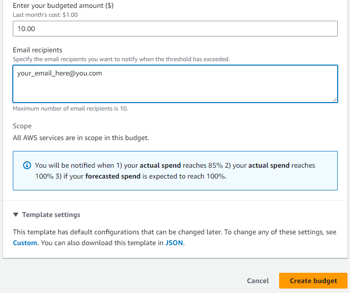

For my purposes I'm setting up that $10 threshold like we talked about. If I exceed that then this case study is a failure and will just be terminated. 

The next step is to get over to the EC2 service console and check into the AWS AMI Marketplace. A quick search in there shows over 300 different AMI builds that can be used. For the sake of simplicity, and after quickly reviewing the notes on the AMI let's just stick with the one shown below:

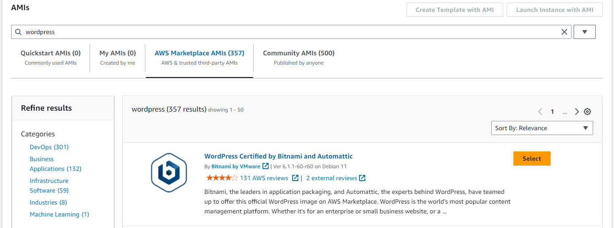

Cracking into the pricing (since this is one of our high level criteria) reveals the following:

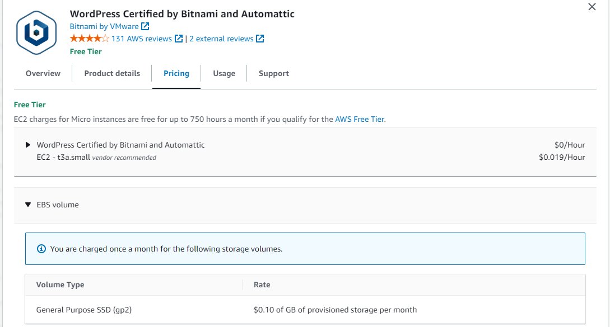

10 cents per GB storage (monthly), 0.019 cents per hour of compute usage. Cool.

Select the AMI and choose 'Launch Instance with AMI' in the upper right hand side of the page.

The next screen is the 'Launch an instance' page where we can configure settings for the EC2 instance. In this case we're going to just leave the defaults for the most part - keep it simple. I would recommend naming your instance something meaningful, for our example I will call it 'cr-wp' (complex robot WordPress) - the other item we absolutely do want to configure now is a keypair for access. If you already have a keypair you can use then go for it, in my case I do not (this is my maiden voyage into EC2 instance launching!)

Click on the link for 'Create new keypair', select whichever key type is appropriate for your system (pem or ppk) and then use it for the instance we are launching. All other defaults are fine for now, click 'Launch instance'.

.....aaaannnnd we are immediately met with this!

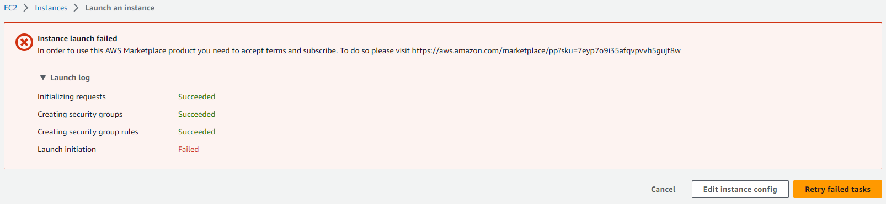

If you've launched this AMI before I assume you won't see this - I'm going to go ahead and follow the link to clear this up.

Quick side note - I needed to accept Bitnami's terms of service and subscribe to the AMI, like how you would for a service. I carefully double checked to make sure the cost was zero, minus the fact I'd be paying for my own infrastructure. Across all instance types there is no cost, so post acceptance and subscription I have now received the following:

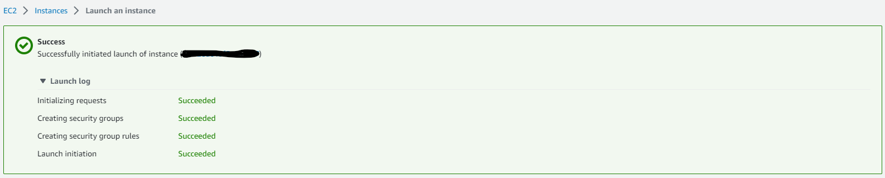

Over to the EC2 console...

My instance is still initializing so I'm going to go ahead and grab a quick cup of coffee, will be back.

Once initialization has completed let's connect to the site via public IP and see what it looks like.

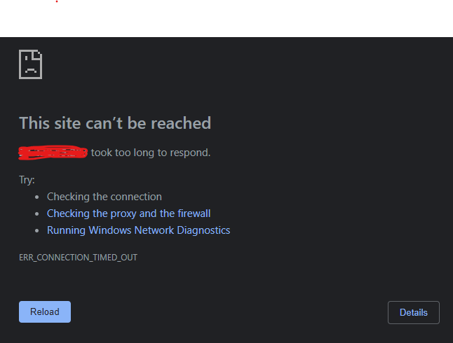

BOO! Ah *but wait*, in the options earlier when we were launching the instance via AMI configuration there was only a security group allowance for port 22 (SSH). Let's head back over to the VPC console and check out our security groups.

In 'VPC' > 'Your VPCs' if you're like me and you've not deployed any infrastructure previously, and or you did not select *where* to deploy this instance to, it will be in your default VPC. Go ahead and click into it (or, conversely, wherever you did deploy this resource).

You can see some additional information here, for what we're doing right now it's not really that important. On the left hand side click into 'Security groups'. You'll likely see something similar to the below:

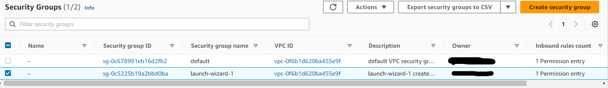

The AMI created a security group called 'launch-wizard-1' - depending on how many you launched, maybe there would be more. It's out of scope for what we're doing here so I'm not going to worry about it too terribly much. The important thing to note here though is that you only see one inbound rule allowed for SSH. We need to add both HTTP (for now) and HTTPS. Click on the 'Edit inbound rules' button and add a rule for both HTTP and HTTPS as below:

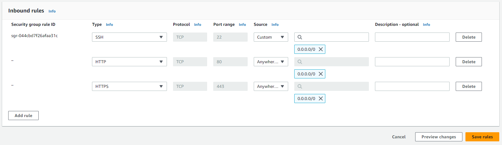

Click 'Save rules' and head back over to the EC2 console. Click into the instance for our WordPress setup and click on the link to open the 'Public IPv4 address' now. (you can use the little 'open address' link next to the IP that's been assigned).

Et voila!

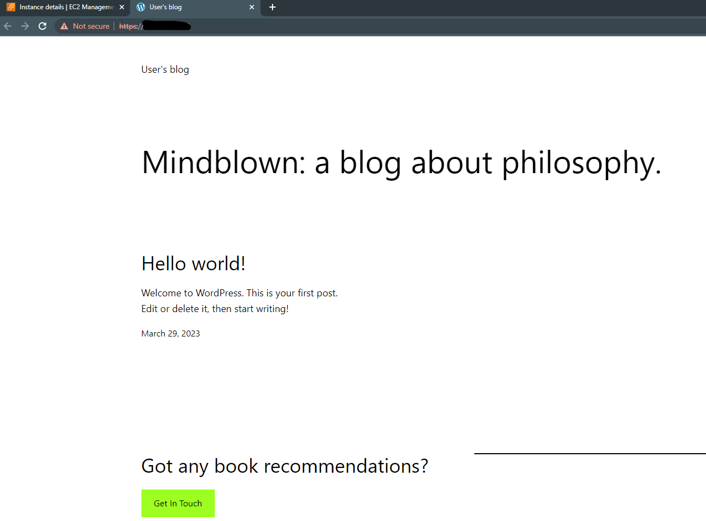

Ok great. The server is running, we can access it. Before we close shop for the day there is one very important thing we need to grab before it disappears forever - the admin login and password.

Close the open window for the WP site and still within the instance details screen click Actions > 'Monitor and troubleshoot' > 'Get system log'

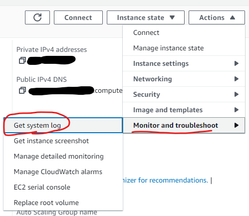

In here you'll be presented with the system log for the running instance. Scroll up a bit in this window until you find the section that looks similar to the below:

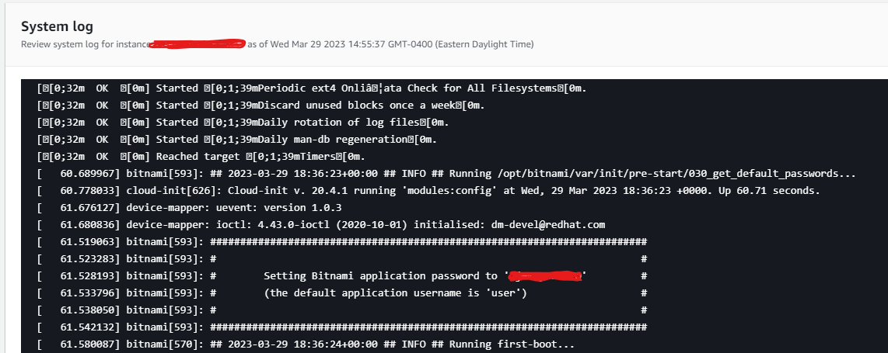

**WRITE DOWN THIS USERNAME AND PASSWORD**. It will disappear once the log rotates and you will never get it back ever again. You'll need to destroy the instance and create a new one if you lose this (and don't have any other admin logins).

Let's test it out very quickly... from the EC2 instance details page open up the WP site again but at the end of the URL put a '/admin' - in the WordPress login box enter 'user' and the password you got from the system log just before.

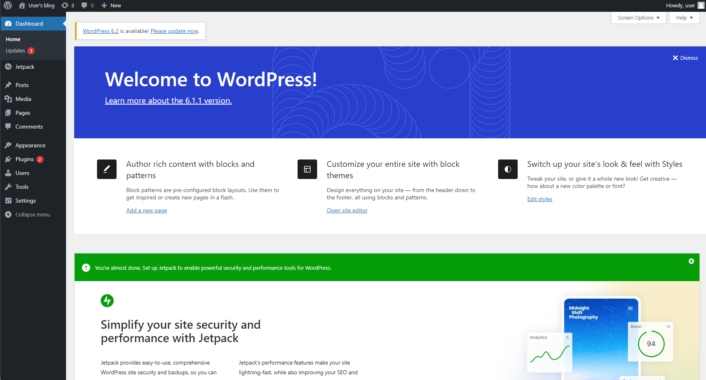

Success! So to recap what we've done today:
* Picked a decent looking AMI for WordPress, launched it into our default VPC and allowed it to initialize.
    * As part of this process we also generated a connection key which we will need later. **BE SURE YOU SAVED THIS**
* Accepted the terms of service and also subscribed to Bitnami since it's just what we need to do in order to deploy it in this way.
* Adjusted our security group to allow port 80 and 443 inbound. Right now we're just using HTTP, later on we'll configure this for HTTPS but we may as well allow it.
* Grabbed the admin username and password from the system log and made note of it. Tested login and verified all is working well.

There is still a lot of foundational stuff we need to work out before we can really get started... next we will ensure we can connect to the instance using SSH. We will make sure we can which services are running. We will also attempt to connect to this instance using a proper DNS name (this may or may not require an ALB, I think it will, but we'll get into the weeds and figure it out).

Be well everyone. Be back soon!

## April 2nd, 2023

I received my end of month billing statement and it's like a 400% increase from normal... I'm not 100% sure yet, I need more days of data collection, but it seems like even an EC2 instance running WordPress that I've done NOTHING ELSE with costs approximately 40 cents a day? Multiply that by 30 days and we're at around $15 a month... and that's without an ALB for routing traffic to the EC2 instance, without setting up the DNS for it, etc (though I don't anticpate DNS queries would come with any specific cost).

I'm going to keep a close eye on this over the next few days but if this is in fact the running cost for an idle instance I would already say it's not worth going this route... but, stay tuned!

## April 7th, 2023 - Shut it down!!!

So I haven't hit my budget alert yet, but since I was working on something else in AWS today I thought I'd take a look and see what was going on with this little project. The EC2 instance simply sucking up CPU cycles doing NOTHING is costing 45 cents a day. Bear in mind I haven't configured WP yet, I haven't uploaded any content, I haven't configured the ALB or DNS yet. Nothing, nada. You can see below that at best I'm going to exceed my planned for budget:

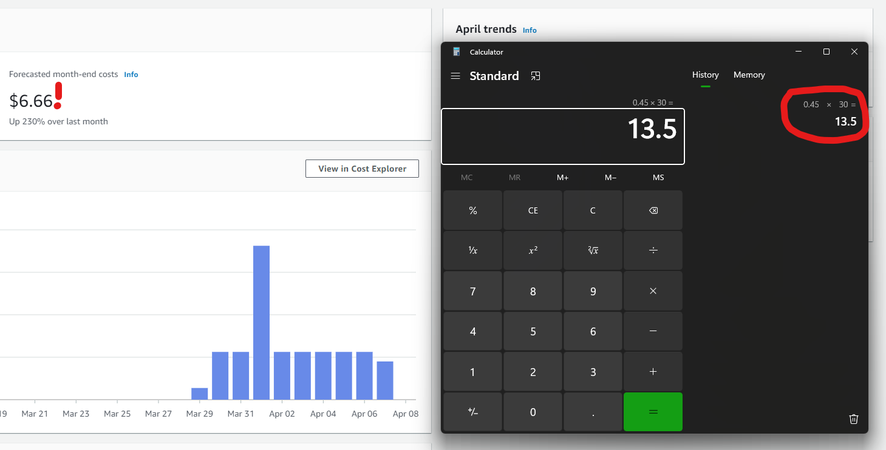

Does it bust it by much? No. But keeping in mind I have literally done nothing with it I can't recommend this as the way to go if you're interested in using WordPress. Larger companies that specialize in this hosting are doing it at scale with things like reserved instances and data cost breaks on quantity and it's something you're just not going to be able to compete with on your own.

That said, there's nothing stopping you from setting up a server at your house and hosting a WordPress site; that is entirely out of scope for this discovery session.

## Recap

Can you host your own WordPress site on AWS? You sure can. Should you? Yeeeaaahhhhh probably not.

## Important notes and limitations

I think the key takeaway is that companies that do this on the regular are able to do so at a lower cost to themselves because of the sheer quantity they are hosting. With AWS (and likely most cloud providers) if you prepay and reserve capacity you get a better price, it's all still mostly managed by the cloud provider and you just get a small(er) piece of the pie that you get upcharged for.

Considering I ultimately have no desire to use WordPress in my site designs this isn't an option I'm going to explore further, I'll stick with S3 hosted sites, but nevertheless, the option is here.

Thanks for sticking around all, hopefully my next project will be something more fruitful (I'm 2 for 2 busts on these last ones).

March 29th, 2023 - April 7th, 2023
